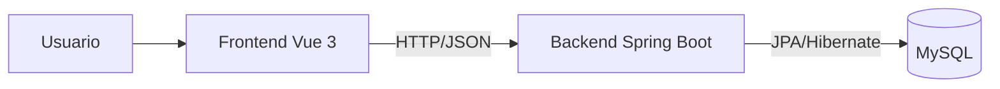

# gestion-bibliotecaria

Sistema de gestión bibliotecaria desarrollado como proyecto académico de Ingenieria de Software. Incluye un backend en Java con Spring Boot y un frontend en Vue 3 para administrar usuarios, libros, préstamos, reseñas y pagos de amonestaciones

## Tabla de contenido
- [Descripcion](#descripcion)
- [Caracteristicas](#caracteristicas)
- [Capturas](#capturas)
- [Requisitos](#requisitos)
- [Instalacion](#instalacion)
- [Como ejecutar](#como-ejecutar)
- [Base de datos](#base-de-datos)
- [Estructura del proyecto](#estructura-del-proyecto)
- [Diagrama de arquitectura](#diagrama-de-arquitectura)
- [Guia de endpoints](#guia-de-endpoints)
- [Documentacion](#documentacion)
- [Notas](#notas)
- [Licencia](#licencia)

## Descripcion
El proyecto implementa un sistema web para la gestion de una biblioteca. Permite registrar usuarios y libros, gestionar prestamos y devoluciones, registrar reseñas y comentarios, y manejar amonestaciones con verificacion de pagos (simulado)

## Caracteristicas
- Autenticación y roles básicos (usuario y bibliotecario)
- Gestión de libros: registro, modificacion, busqueda y eliminación
- Gestión de préstamos: crear, renovar y devolver
- Reseñas y comentarios asociados a libros
- Amonestaciones con verificación de pago
- API REST con Spring Boot y persistencia con JPA
- Interfaz web en Vue 3 consumiendo la API via Axios

## Capturas


## Requisitos
- Java 21
- Maven 3.9+
- Node.js 18+ (con npm)
- MySQL 8+

## Instalacion
Este proyecto esta desarrollado con:
- Frontend: Vue 3 (Vue CLI) y Axios
- Backend: Java 21, Spring Boot 3.4.5, Spring Web, Spring Data JPA, Spring Security, Lombok
- Base de datos: MySQL

Pasos generales:
1. Clona el repositorio
2. Configura la base de datos en `src/main/resources/application.properties`
3. Instala dependencias del frontend con `npm install` en `biblioteca-frontend`
4. Compila/ejecuta el backend con Maven

## Como ejecutar
### Backend (Spring Boot)
Desde la raiz del proyecto:
```
./mvnw spring-boot:run
```
Si usas Windows:
```
mvnw.cmd spring-boot:run
```

### Frontend (Vue)
Desde `biblioteca-frontend`:
```
npm install
npm run serve
```

## Base de datos
La aplicación usa MySQL y se conecta a la base `biblioteca_db`

Configuracion actual (ver [src/main/resources/application.properties](src/main/resources/application.properties)):
- URL: `jdbc:mysql://localhost:3306/biblioteca_db`
- Usuario: `root`
- Contraseña:

El esquema de la base se encuentra en [src/main/resources/sql/schema.sql](src/main/resources/sql/schema.sql). Las tablas principales son:
- `usuarios`
- `libros`
- `prestamos`
- `amonestaciones`
- `resenas`
- `comentario_resena`

Si quieres inicializar manualmente la base, ejecuta el script `schema.sql` en tu servidor MySQL. El archivo [src/main/resources/sql/data.sql](src/main/resources/sql/data.sql) esta vacio por defecto

## Estructura del proyecto
```
.
├─ biblioteca-frontend/         # Cliente Vue 3
│  ├─ public/                   # HTML base
│  └─ src/                      # Componentes y app Vue
├─ documentacion/               # Documentacion del proyecto
├─ imagenes/                    # Capturas para el README
├─ src/
│  ├─ main/
│  │  ├─ java/com/biblioteca/   # Backend Spring Boot
│  │  │  ├─ config/             # Configuracion (seguridad, etc)
│  │  │  ├─ controller/         # Controladores REST
│  │  │  ├─ dto/                # Objetos de transferencia
│  │  │  ├─ model/              # Entidades JPA
│  │  │  ├─ repository/         # Repositorios JPA
│  │  │  ├─ security/           # Servicios de seguridad
│  │  │  └─ service/            # Logica de negocio
│  │  └─ resources/
│  │     ├─ application.properties
│  │     └─ sql/                # Scripts de BD
│  └─ test/                     # Pruebas
└─ pom.xml                      # Configuracion Maven
```

## Diagrama de arquitectura


## Guia de endpoints
Base URL: `/api`

### Autenticacion y usuarios
- POST `/login`
- POST `/usuarios/registro`
- GET `/usuarios/me`
- PUT `/usuarios/nombre`
- PUT `/usuarios/contrasena`
- DELETE `/usuarios`

### Libros
- GET `/libros`
- POST `/libros`
- GET `/libros/isbn/{isbn}`
- PUT `/libros/isbn/{isbn}`
- DELETE `/libros/isbn/{isbn}`

### Prestamos
- POST `/prestar`
- POST `/prestamos/devolver`
- GET `/prestamos`
- GET `/prestamos/activos`
- GET `/prestamos/usuario/{usuarioId}`
- GET `/prestamos/finalizados`
- PUT `/prestamos/{id}/renovar`

### Resenas y comentarios
- POST `/resenas`
- GET `/resenas/libro/{libroId}`
- PUT `/resenas/{id}`
- DELETE `/resenas/{id}`
- POST `/comentarios-resena`
- GET `/comentarios-resena/resena/{resenaId}`
- PUT `/comentarios-resena/{id}`
- DELETE `/comentarios-resena/{id}`

### Amonestaciones
- GET `/amonestaciones-usuario/mis-amonestaciones`
- PUT `/amonestaciones-usuario/pagar`
- GET `/amonestaciones-usuario/todas`
- PUT `/amonestaciones-usuario/verificar/{id}`
- DELETE `/amonestaciones/{id}`

## Documentacion
La documentacion del proyecto se encuentra en la carpeta [documentacion](documentacion)

## Notas
- Proyecto académico para la materia de Ingenieria de Software
- Configura credenciales de base de datos antes de ejecutar
- Para despliegue, compila el frontend con `npm run build`

## Licencia
Uso académico 
