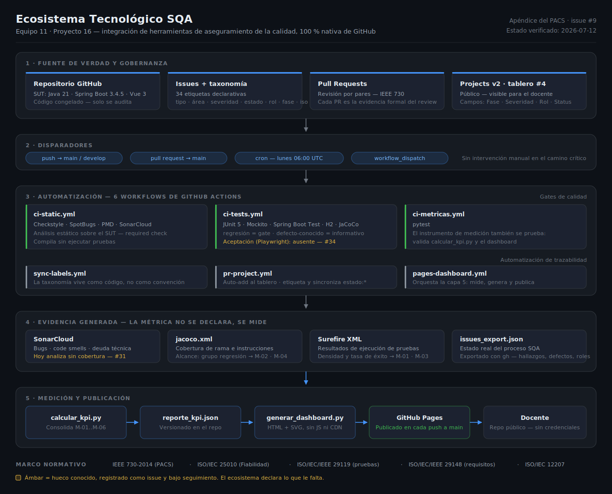

# Anexo — Infograma del Ecosistema Tecnológico

| Campo | Valor |
|---|---|
| Documento | Infograma del Ecosistema Tecnológico — apéndice de `sqa/PACS.md` §4.3 |
| Identificador | ANX-ECO-001 |
| Versión | 1.0 |
| Fecha | 2026-07-12 |
| Equipo SQA | Equipo 11 — Proyecto 16 |
| Issue | #9 |
| Estado | Emitido |

---

## 1. Propósito

Este anexo satisface el criterio **e) Ecosistema tecnológico** de la rúbrica: un esquema visual de la integración entre las herramientas que sostienen el proceso de aseguramiento de la calidad, y de cómo el trabajo fluye entre ellas sin intervención manual en el camino crítico.

> **Fuente**: [`infograma-ecosistema.svg`](infograma-ecosistema.svg). El infograma es un SVG versionado en el repositorio: es texto, se revisa por Pull Request y se diferencia línea a línea como cualquier otro artefacto. No es una imagen opaca importada desde una herramienta externa.

---

## 2. Lectura del infograma

El ecosistema se organiza en **cinco capas**, y la pieza se lee de arriba hacia abajo siguiendo el recorrido de un cambio: desde que entra al repositorio hasta que se convierte en una métrica publicada.

| Capa | Qué hace | Piezas |
|---|---|---|
| **1 — Fuente de verdad y gobernanza** | Todo el proceso vive en el repositorio. No hay una herramienta externa que sea dueña de una parte de la verdad. | Repositorio (SUT congelado), issues con taxonomía de 34 etiquetas, Pull Requests como evidencia formal de peer-review IEEE 730, tablero Projects v2 #4 |
| **2 — Disparadores** | El proceso se ejecuta solo. Nadie tiene que acordarse de correr nada. | `push` a `main`/`develop`, `pull_request` hacia `main`, cron semanal, ejecución manual |
| **3 — Automatización** | Seis workflows de GitHub Actions: tres son gates de calidad, tres automatizan la trazabilidad. | `ci-static`, `ci-tests`, `ci-metricas` · `sync-labels`, `pr-project`, `pages-dashboard` |
| **4 — Evidencia generada** | Las métricas no se declaran: se derivan de artefactos producidos por la ejecución real. | SonarCloud, `jacoco.xml`, reportes Surefire, `issues_export.json` |
| **5 — Medición y publicación** | La evidencia se consolida en métricas y se publica sin intervención humana. | `calcular_kpi.py` → `reporte_kpi.json` → `generar_dashboard.py` → GitHub Pages → docente |

---

## 3. Decisiones de arquitectura que el infograma hace visibles

**El ecosistema es 100 % nativo de GitHub.** Se descartaron Jira y Confluence. La razón no es de comodidad: los entregables viven como markdown versionado en `sqa/` y se revisan por Pull Request, de modo que **la revisión por pares que exige IEEE 730 queda registrada en la misma herramienta que guarda el artefacto**. Una wiki o un Confluence habrían roto esa cadena de evidencia — el documento por un lado, la aprobación por otro.

**La taxonomía vive como código.** Las 34 etiquetas (`tipo` · `área` · `severidad` · `estado` · `rol` · `fase` · `iso`) se declaran en un archivo y las sincroniza `sync-labels.yml`. No son una convención que el equipo recuerde de memoria; son un artefacto versionado. Eso es lo que permite que `calcular_kpi.py` derive métricas de proceso a partir de los issues sin ambigüedad.

**El instrumento de medición también se prueba.** `ci-metricas.yml` corre `pytest` sobre `calcular_kpi.py` y el generador del dashboard. Un sistema de calidad que no verifica su propia herramienta de medición no tiene derecho a publicar los números que produce.

**La suite dinámica está partida en dos universos.** El grupo `regresion` es el gate de integración; el grupo `defecto-conocido` codifica defectos reales detectados en el SUT y falla de forma esperada, ejecutándose de modo informativo. La cobertura y las métricas se calculan **solo sobre `regresion`**, para que el número publicado signifique algo. El desglose está en `PACS.md` §5.1.

**El sitio publicado es self-contained.** El dashboard se genera como HTML con SVG embebido, sin dependencias externas: sin CDN, sin fuentes remotas, sin `fetch`; el único JavaScript es el conmutador de tema inline propio (desvío registrado en `PACS.md` §6.3, issue #62). El infograma respeta el mismo criterio y por eso es SVG y no una imagen generada por una herramienta de diagramas: se integra al sitio sin arrastrar dependencias.

---

## 4. Huecos declarados

Un infograma que dibuja un ecosistema perfecto es propaganda. Este declara lo que le falta, en **ámbar**, y cada hueco tiene un issue abierto:

| Hueco | Dónde se ve | Issue |
|---|---|---|
| SonarCloud analiza **sin datos de cobertura**: el scan corre en `ci-static.yml` (que compila sin ejecutar pruebas) y el `jacoco.xml` se genera en `ci-tests.yml`. Los dos insumos existen y nunca coinciden en el mismo job. | Capa 4 — tarjeta *SonarCloud* | [#31](https://github.com/odjaramillo/gestion-bibliotecaria-sqa/issues/31) |
| **Sincronización parcial del tablero**: la columna *Status* de Projects v2 no se refleja automáticamente desde las etiquetas `estado:*`; hay dos fuentes de verdad para el mismo dato. *(Los cuatro niveles dinámicos —incluida la aceptación E2E con Playwright, `ci-e2e.yml`— ya están implementados y en ejecución.)* | Capa 5 — tablero Kanban | [#11](https://github.com/odjaramillo/gestion-bibliotecaria-sqa/issues/11) |

---

## 5. Trazabilidad

- **Apéndice de**: [`sqa/PACS.md`](../PACS.md) §4.3 (ecosistema y herramientas)
- **Matriz operativa**: [`herramientas-fase2.md`](herramientas-fase2.md) — el detalle herramienta por herramienta que este infograma sintetiza
- **Estado del ecosistema**: [`ECOSISTEMA-ESTADO.md`](../ECOSISTEMA-ESTADO.md)
- **Reflexión crítica** (complementa este anexo): issue [#10](https://github.com/odjaramillo/gestion-bibliotecaria-sqa/issues/10)
- **Fuentes verificadas**: `.github/workflows/*.yml` (7 workflows), `sqa/metricas/calcular_kpi.py`, `sqa/metricas/generar_dashboard.py`

---

## 6. Control de versiones

| Versión | Fecha | Autor | Cambios |
|---|---|---|---|
| 1.0 | 2026-07-12 | Equipo SQA — rol `lider-tec` | Emisión inicial del infograma del ecosistema tecnológico (issue #9). SVG versionado, cinco capas, marco normativo y huecos declarados (#31, #34). |
